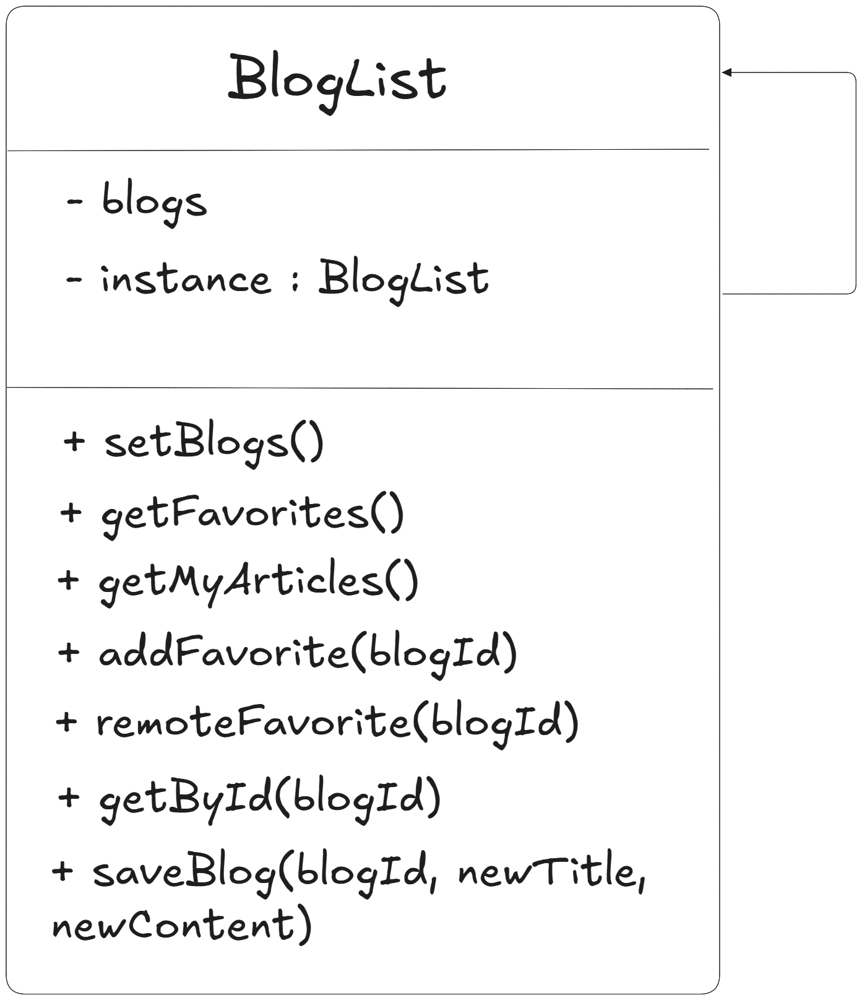
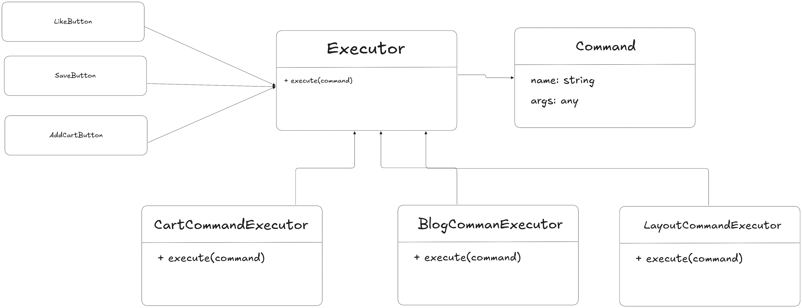
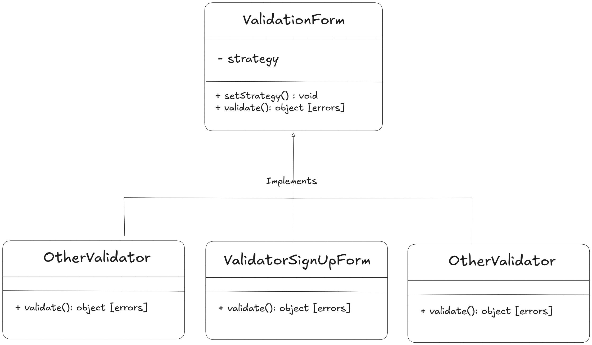

# ExamenFinal-AplicacionesWeb

## Estructura General del Proyecto

### Backend

El backend está ubicado en la carpeta `backend/` y tiene la siguiente estructura principal:

- **prisma/**: Contiene la configuración y el esquema de la base de datos (`schema.prisma`).
- **src/**: Carpeta principal del código fuente.
  - **db.js**: Configuración de la conexión a la base de datos.
  - **index.js**: Punto de entrada de la aplicación.
  - **server.js**: Configuración y arranque del servidor.
  - **router.js**: Configuración de rutas principales.
  - **generated/**: Código generado automáticamente por Prisma.
  - **handlers/**: Módulos para manejar la lógica de negocio de cada entidad (blog, order, product, reservation, user).
  - **middlewares/**: Middlewares personalizados, por ejemplo, para manejo de input de usuario.
  - **modules/**: Módulos auxiliares, como autenticación.
  - **routers/**: Definición de rutas específicas para cada entidad.
  - **validators/**: Validadores para las distintas operaciones y entidades.

---

### Frontend

El frontend está ubicado en la carpeta `frontend/` y su estructura principal es la siguiente:

- **index.html**: Archivo principal HTML. Aquí se implementa el patrón Layout para la estructura base de la aplicación.
- **index.js**: Punto de entrada del JavaScript.
- **index.css**: Estilos globales.
- **assets/**: Recursos estáticos como imágenes y fuentes.
- **blocks/**: Componentes reutilizables y sus estilos, organizados por funcionalidad (por ejemplo, `aboutPage`, `blogCard`, `menuPage`, etc.).
- **data/**: Archivos JSON con datos de ejemplo (blogs, productos).
- **services/**: Servicios y lógica de negocio del frontend.
  - **BlogList.js**, **ProductList.js**, **Cart.js**, etc.: Implementados como Singletons para manejar el estado y la lógica de cada entidad.
  - **Command/**: Implementa el patrón Command para encapsular acciones y operaciones.
  - **Validators/**: Implementa el patrón Strategy para la validación flexible de formularios y datos.
  - **Api/**, **conf/**: Otros servicios auxiliares.
- **utils/**: Utilidades generales, como manejo de tiempo.

---

## Patrones de Diseño Utilizados

- **Frontend**
  - **Layout**: Implementado en `index.html` para la estructura base de la aplicación. Permite definir una estructura común reutilizable en todas las páginas.
  - **Singleton**: Usado en servicios como `BlogList.js` y `Cart.js` para asegurar que solo exista una instancia global que maneje el estado de los blogs y el carrito respectivamente.
    - Ejemplo: `BlogList.js` mantiene la lista de blogs y sus favoritos como una única instancia accesible desde cualquier parte de la app.
  - **Command**: Implementado en la carpeta `services/Command/` (por ejemplo, `BlogCommand.js` y `CartCommand.js`). Permite encapsular acciones como agregar/quitar favoritos o realizar pedidos en objetos comando, facilitando la extensión y el manejo de operaciones.
    - Ejemplo: `BlogCommandExecutor` y `CartCommandExecutor` ejecutan comandos como agregar a favoritos o realizar una orden, desacoplando la lógica de la UI.
  - **Strategy**: Implementado en la carpeta `services/Validators/` para la validación de formularios. Permite intercambiar diferentes estrategias de validación según el tipo de formulario.
    - Ejemplo: `ValidatorForm.js` recibe una estrategia como `ValidatorLoginForm.js` para validar distintos formularios de manera flexible.

---

### Resumen de patrones en el frontend

- **Singleton**: `BlogList.js`, `Cart.js` (manejo de estado global de blogs y carrito)

- **Command**: `BlogCommand.js`, `CartCommand.js` (acciones encapsuladas para blogs y carrito)

- **Strategy**: `services/Validators/` (validación de formularios con estrategias intercambiables)

- **Layout**: `index.html` (estructura base reutilizable)

## Figma
[Link al figma](https://www.figma.com/design/ZFRTKSfgtjtv0mIJXLP2aw/ExamenFinal---AppsWeb---Rafael-Vargas?node-id=0-1&t=Tp6fUMub07pRFeaH-1)

